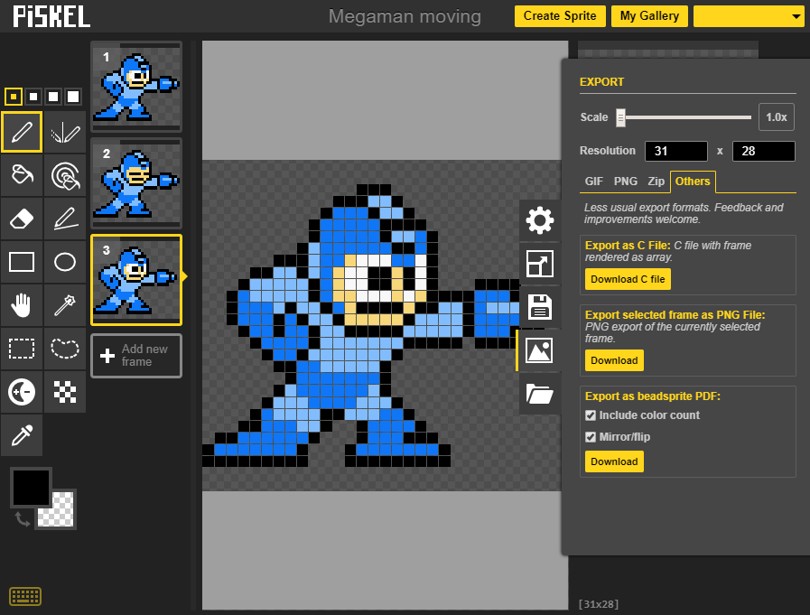
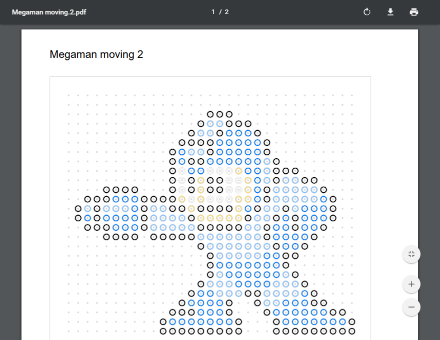
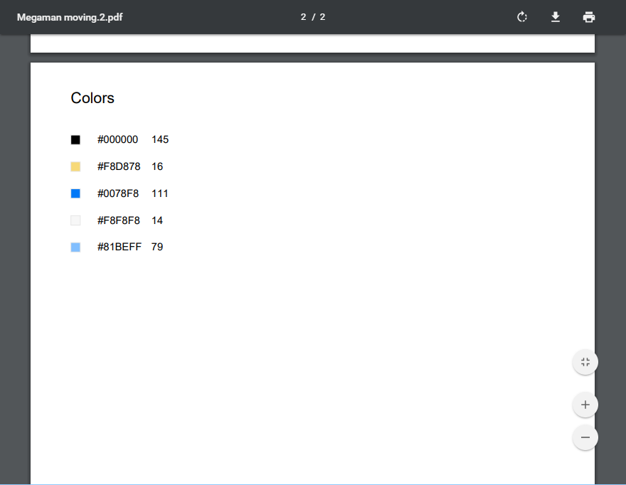

# piskel-beadsprite

This [userscript](https://en.wikipedia.org/wiki/Userscript) adds export options for [beadsprite](https://www.reddit.com/r/beadsprites/comments/fatft/faq_beadsprites_101/) use-cases to [piskel (sprite editor)](https://github.com/piskelapp/piskel).

Installable via [OpenUserJS](https://openuserjs.org/scripts/sopelt/Piskel_Beadsprite_Export), applies directly to [hosted piskel](https://www.piskelapp.com).

## Goals

 * simple workflow for printing pixel sprites for bead setting
 * efficient use of printer toner
 * intuitive visual representation
 * 1:1 scale

## Features

 * export to PDF (via [jsPDF](https://github.com/MrRio/jsPDF))
 * flip/mirror
 * color/bead count

## Limitations

 * regular grid only (no hexagon, custom shapes)

## Screenshots

## Feedback

Feedback is very welcome. Just open an issue.
